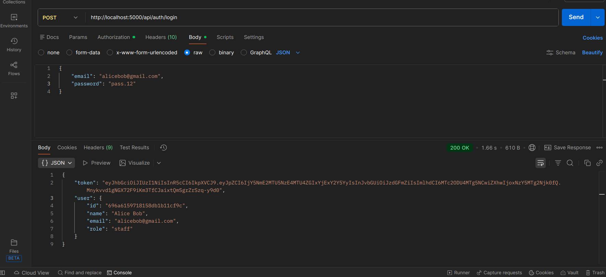
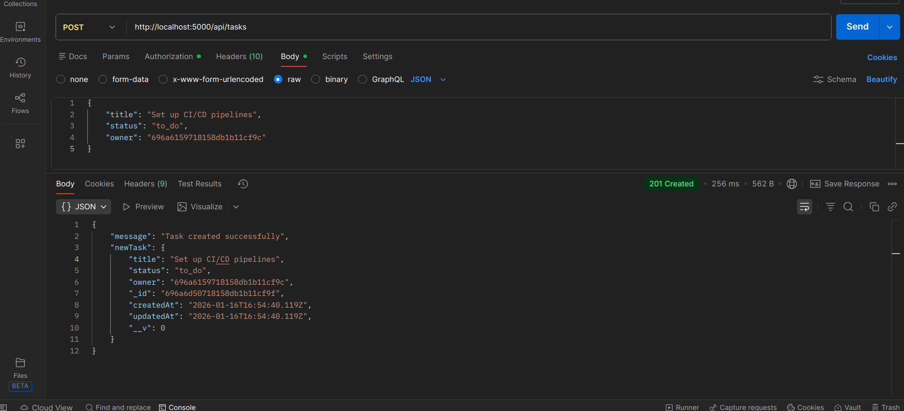
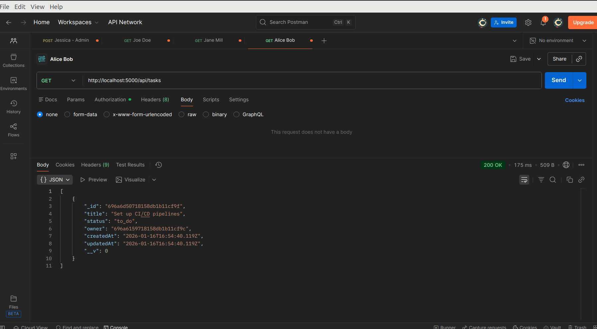
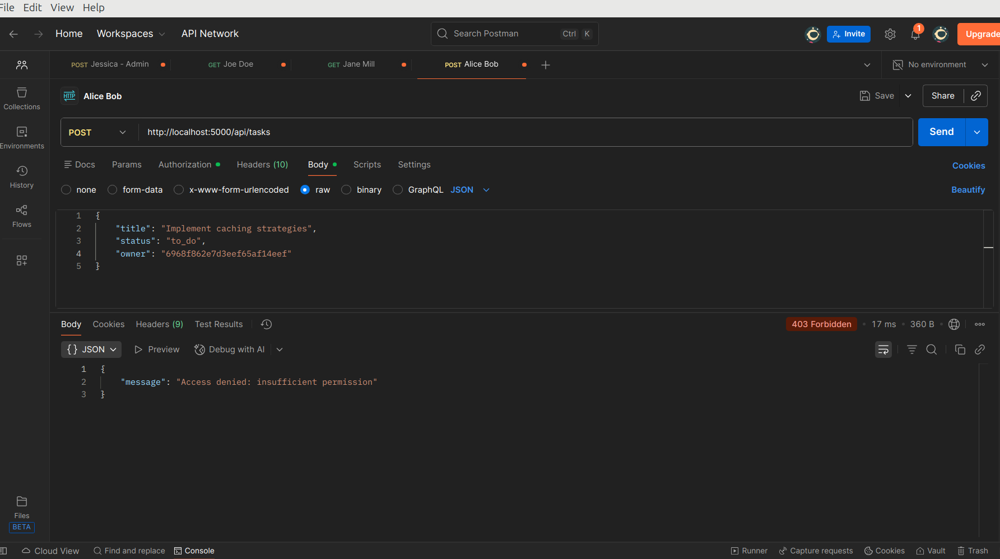

# Task Manager API

A production-ready **RESTful Task Manager API** built with **Node.js, Express, MongoDB, JWT authentication, and role-based authorization**.

This API demonstrates clean backend architecture, secure authentication, and real-world access control patterns suitable for scalable applications.


## Why This Project Matters

This project showcases:
- Secure authentication & authorization
- Proper backend folder structure
- Middleware-driven access control
- Clean separation of concerns
- Real-world API behavior (users only see their own data)

Designed with **maintainability, security, and scalability** in mind.


## Features

- **User Authentication:** JWT-based login and registration  
- **Role-based Authorization:** Admin vs regular users  
- **User Management:** Create, read, update, delete users  
- **Task Management:** CRUD operations with ownership rules  
- **Profile Management:** Users can update their own profile  
- **Password Security:** Passwords hashed using bcrypt  
- **Input Validation:** Using express-validator for request validation  
- **Error Handling:** Centralized error middleware


## Tech Stack

- **Node.js**  
- **Express.js**  
- **MongoDB & Mongoose ODM**  
- **bcryptjs** for password hashing  
- **jsonwebtoken (JWT)** for authentication  
- **express-validator** for input validation  
- **Cors** for handling cross-origin requests
- **Postman** (API testing)


## API Endpoints

> **All endpoints were tested using Postman**

### i). **Auth Routes (`/api/auth`)**

| Method | Endpoint | Description |
|------|---------|------------|
| POST | `/api/auth/register` | Register a new user |
| POST | `/api/auth/login` | Login user and receive JWT |
| GET | `/api/auth/me` | Get logged-in user profile |
| PUT | `/api/auth/me` | Update own profile |
| PUT | `/api/auth/me/password` | Update own password |


### ii). **User Routes (`/api/users`) — With authorization**

| Method | Endpoint | Description |
|------|---------|------------|
| GET | `/api/users` | Get all users |
| GET | `/api/users/:id` | Get user by ID |
| POST | `/api/users` | Create user |
| PUT | `/api/users/:id` | Update user |
| DELETE | `/api/users/:id` | Delete user |


### iii). **Task Routes (`/api/tasks`)**

| Method | Endpoint | Access | Description |
|------|---------|-------|------------|
| GET | `/api/tasks` | User/Admin | User gets own tasks, Admin gets all |
| GET | `/api/tasks/:id` | User/Admin | Get single task |
| POST | `/api/tasks` | Admin | Create task |
| PUT | `/api/tasks/:id` | User/Admin | User updates own task, Admin updates any |
| DELETE | `/api/tasks/:id` | Admin | Delete task |


## Authentication

Protected routes require a JWT token.

```makefile
Authorization: Bearer <JWT_TOKEN>
```

## Postman Testing

All endpoints were tested using **Postman**, including:

- Auth flows (register/login/me)
- Role-based access checks
- Token validation
- Authorization errors
- Admin vs user permissions

### Example Postman Testing Screenshots

### i). Login & JWT Token


### ii). Admin Creating a Task


### iii). User Viewing Own Tasks


### iv). Forbidden Access: "Normal" user trying to create a task



## Run Locally

### 1. Clone the repo

```bash
git clone https://github.com/scviola/task-manager-backend.git
cd task-manager-backend
```

### 2. Install dependencies
```bash
npm install
# or
pnpm install
```

### 3. Environment Variables

Create a `.env`:

```env
PORT=5000
MONGO_URI=<your_mongodb_connection_string>
JWT_SECRET=<your_jwt_secret>
```

### 4. Start server
```bash
npm run dev    # development (nodemon)
npm start      # production
```

The API will be running at: 
```arduino
http://localhost:5000
```

## Deployment
This API is deployed using **Render**.

## License
**MIT**